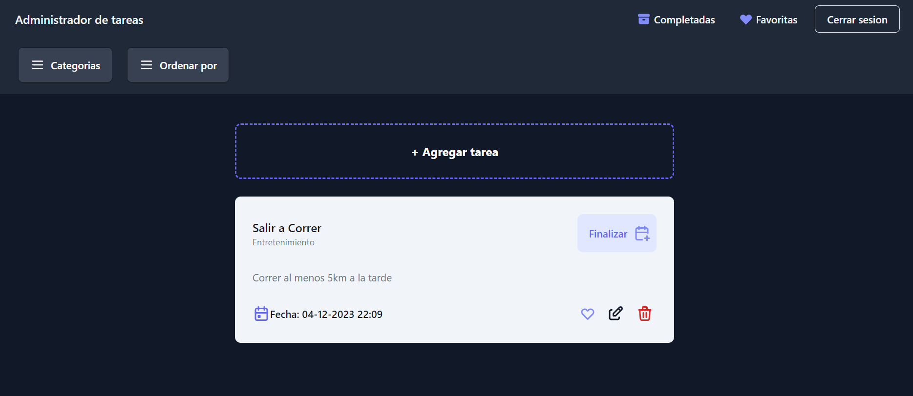

# Proyecto Final Grupo 1

### Desarrollado por Pablo Uriel Gomez y Matias Ezequiel Bussetti

En este proyecto consiste de un Simple TodoList, con categoría, tarea completada y favorita.



---

# Resumen de Desarrollo

Las tareas se an dividido de la siguiente manera (no estrictamente):

- **FrontEnd: Pablo Uriel Gomez**
- **BackEnd: Matias Ezequiel Bussetti**

## Full Stack

### BackEnd:

####  como Lenguaje Principal

####  como Interprete

####  como Libreria para hacer aplicaciones apiRest

####  como Sistema de almacenamiento temporaneo

####  como Base de Datos no relacional

### FrontEnd:

####  como Lenguaje Principal

####  como Framework de Componentes

####  como Base de Datos de Autenticación

---

# Como utilizar

Se debe considerar tener instalado, **mongoDB** y **Redis**. En el caso de utilizar otro Host que contiene estos, modicar el `.env` ubicado en `/backend`.

_Abir_ una _consola_ o _teminal_ en _raiz_ del proyecto:

```shell
cd backend
npm install
npm run start
```

_Abrir_ otra _consola_ o _terminal_ en _raiz_ del proyecto:

```shell
cd frontend--check
npm install
npm run dev
```

---

# Como Utilizar Docker

Para utilizar `Docker compose` se debe _modificar_ las siguientes cosas:

1. En `/backend` _cambiar_ el nombre del archivo `.env` a `.env.<texto>`
2. Cambiar el nombre del archivo `.env.docker.example` a `.env`
3. _Ir_ a la carpeta `/docker`
4. En la carpeta `/nginx`, se _encuentra_ el archivo `.conf` el cual se debe _modificar_ si se quieren agregar más app node
5. _Ir_ a la carpeta `/docker` y correr `docker compose up`
